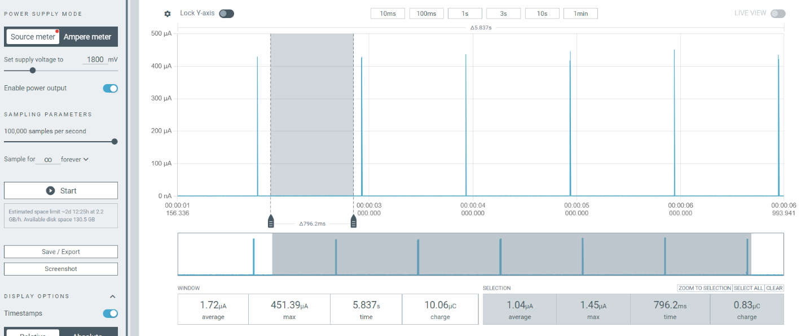

# AM1805 RTC Driver for Zephyr OS (Nordic)

This repository provides a C driver implementation for the **Ambiq AM1805 Real-Time Clock (RTC)**, specifically designed to run on **Zephyr OS** using **Nordic Semiconductor hardware**. The driver enables basic RTC functionalities, including reading time, setting alarms, and configuring timers.

## Features
- Read the current RTC time.
- Set an alarm.
- Configure a countdown timer.
- Uses Zephyr's device driver model.
- Compatible with Nordic Semiconductor development kits.

## Hardware Requirements
- **Nordic Development Kit** (e.g., nRF52840-DK, nRF5340-DK, etc.)
- **AM1805 RTC Module**
- I2C Connection between the Nordic DK and AM1805

## Zephyr Configuration
Ensure that the `prj.conf` file includes the required configurations for I2C and the RTC:

```ini
CONFIG_I2C=y
CONFIG_LOG=y
```

The AM1805 driver should be enabled in the device tree (`.dts`):

```dts
&i2c1 {
    status = "okay";
    clock-frequency = <I2C_BITRATE_STANDARD>;
    am1805: am1805@68 {
        compatible = "ambiq,am1805";
        reg = <0x68>;
        label = "AM1805";
    };
};
```

## Building and Flashing

To build the application for Nordic hardware:

```sh
west build -b nrf52840dk_nrf52840 .
west flash
```

## Example Applications

### 1. Read RTC Time
```c
#include <zephyr/kernel.h>
#include <zephyr/device.h>
#include <zephyr/drivers/i2c.h>
#include "am1805.h"

void main(void) {
    struct am1805_time time;
    if (am1805_get_time(&time) == 0) {
        printk("Time: %02d:%02d:%02d\n", time.hours, time.minutes, time.seconds);
    } else {
        printk("Failed to read RTC time\n");
    }
}
```

### 2. Set an Alarm
```c
#include "am1805.h"

void main(void) {
    struct am1805_time alarm_time = { .hours = 8, .minutes = 30, .seconds = 0 };
    am1805_set_alarm(&alarm_time);
}
```

### 3. Set a Countdown Timer
```c
#include "am1805.h"

void main(void) {
    am1805_set_timer(10); // Set a timer for 10 seconds
}
```

## Power Consumption experiment
- Measurement device: Nordic PPK2
- Condition: Input supply to VCC2 (main power souce)
- Result: 1.07uA @ 1.8V (datasheet: 50nA chip only)


## License
This project is licensed under the MIT License. See the [LICENSE](LICENSE) file for details.

## Author
Developed and maintained by @ch-binh. For any queries or contributions, please contact [pcbinh.3005@gmail.com](pcbinh.3005@gmail.com).

## Contributing
Contributions are welcome! Please fork this repository and submit pull requests. For major changes, please open an issue first to discuss what you would like to change.

## Acknowledgments
- Thanks to the Zephyr Project for providing an excellent RTOS.
- Special thanks to Nordic Semiconductor for their development kits and support.
- Inspired by the work of the open-source community.

## References
- [Zephyr Project Documentation](https://docs.zephyrproject.org/latest/)
- [Nordic Semiconductor Documentation](https://infocenter.nordicsemi.com/)
- [AM1805 RTC Datasheet](https://ambiq.com/wp-content/uploads/2020/08/AM1805.pdf)

